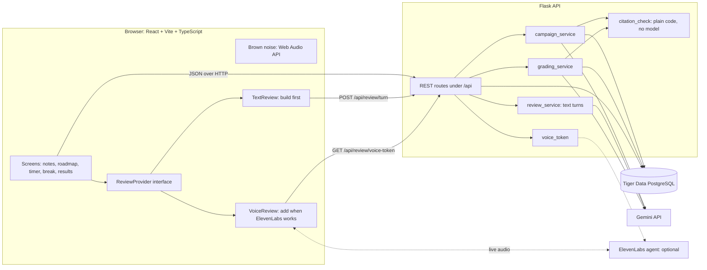
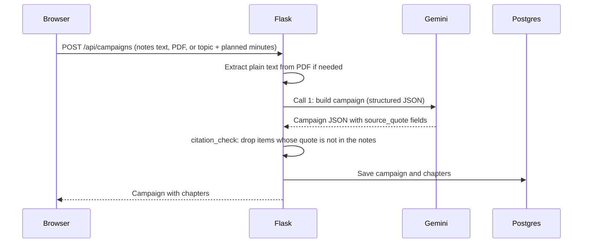
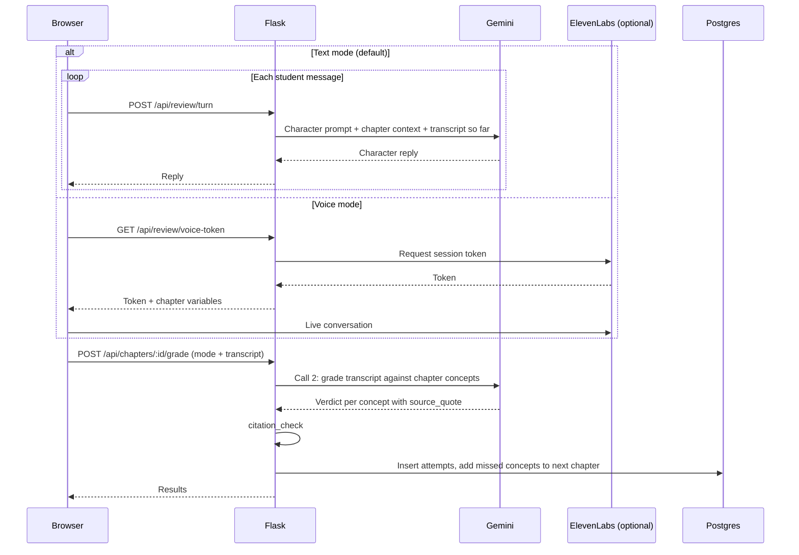

# Quest-Mode Study: Architecture

Reference for anyone working in this repo. Read this before adding files or endpoints.

## What the app does

A student adds notes. Gemini turns them into a fantasy campaign with one chapter per pomodoro. After each focus block the student picks a fun break or a review break. In a review break a character quizzes them, or plays a confused apprentice they must correct. Gemini then grades the conversation per concept, and every verdict cites a quote from the notes. Missed concepts return as "villains" in later chapters.

## Current status

- Tiger Data (PostgreSQL) is provisioned and the schema is applied.
- Gemini is the only model dependency needed to start.
- Built so far: build steps 1 and 2 (campaign creation and reading, citation check, Notes and Roadmap screens). Step 3 is built except the break content (placeholders until steps 4 and 7).
- **ElevenLabs is not available yet.** The app must run fully with `ELEVENLABS_API_KEY` unset. Build the review break in text mode first. Voice is a second provider behind the same interface.

## System diagram



Solid lines are required. Dotted lines are the optional voice path.

## The key design decision: ReviewProvider

Both review providers produce the same output, a transcript. Grading only ever sees the transcript, so it does not care whether the student typed or spoke.

```ts
// frontend/src/review/types.ts
export type ReviewMode = "quiz" | "teachback";

export interface TranscriptTurn {
  role: "character" | "student";
  text: string;
}

export interface ReviewProvider {
  start(chapterId: string, mode: ReviewMode): Promise<void>;
  // Text provider: sends the message and resolves with the character's reply.
  // Voice provider: not used; turns arrive through onTurn.
  send?(message: string): Promise<void>;
  onTurn(callback: (turn: TranscriptTurn) => void): void;
  end(): Promise<TranscriptTurn[]>; // full transcript, handed to grading
}
```

- `TextReview`: each student message goes to `POST /api/review/turn`. Flask calls Gemini with the character prompt and chapter context, and returns the reply.
- `VoiceReview`: asks Flask for a session token, then talks to the ElevenLabs agent directly from the browser using `@elevenlabs/react`. It records each turn into the same `TranscriptTurn[]` shape.
- The character prompt lives in one file, `backend/prompts/character.md`. Text mode sends it to Gemini. Voice mode uses the same text as the ElevenLabs agent prompt.
- On startup the frontend calls `GET /api/config`. If `voice_available` is false, only `TextReview` is offered.

## Flow 1: create a campaign



## Flow 2: review break and grading



## API endpoints

| Method and path | Body | Returns | Notes |
| --- | --- | --- | --- |
| `GET /api/config` | | `{ voice_available, demo_mode }` | `voice_available` is true only when the ElevenLabs env vars are set |
| `POST /api/campaigns` | JSON `{ notes_text \| topic, planned_minutes }`, or multipart with `file` (PDF) and `planned_minutes` | Campaign with chapters, status 201 | Runs Call 1 and the citation check. 400 for a missing or invalid field or a PDF with no text, 502 if generation fails. Errors are `{ error }` |
| `GET /api/campaigns/:id` | | Campaign with chapters | Reads from the database. Never calls the model. 404 `{ error }` for an unknown or malformed id |
| `PATCH /api/chapters/:id` | `status` | Chapter | Status is `locked`, `active`, or `done`. Setting `done` activates the next locked chapter. 400 for a bad status, 404 for an unknown id |
| `POST /api/review/turn` | `chapter_id`, `mode`, `transcript`, `message` | `{ reply }` | Text mode only |
| `GET /api/review/voice-token` | query: `chapter_id`, `mode` | `{ token, variables }` | Returns 503 when voice is not configured |
| `POST /api/chapters/:id/grade` | `mode`, `transcript` | `{ results }` | Runs Call 2 and the citation check, writes `attempts` |
| `GET /api/campaigns/:id/progress` | | Attempts over time | Stretch, for the progress chart |

## Data shapes

Campaign JSON, the output of Call 1:

```json
{
  "title": "The Siege of Mitochondria Keep",
  "premise": "One line of story.",
  "chapters": [
    {
      "position": 1,
      "title": "Chapter title",
      "story_beat": "Two sentences of story.",
      "concepts": [
        { "name": "Concept", "explanation": "Short explanation.", "source_quote": "Exact words from the notes." }
      ],
      "quiz": [
        { "question": "Question?", "answer": "Answer.", "source_quote": "Exact words from the notes." }
      ],
      "misconception": {
        "wrong_claim": "What the apprentice says.",
        "correction": "The truth.",
        "source_quote": "Exact words from the notes."
      }
    }
  ]
}
```

Campaign API response, returned by `POST /api/campaigns` and `GET /api/campaigns/:id` (built from the `campaigns` and `chapters` tables, not from `campaign_json`):

```json
{
  "id": "uuid",
  "title": "The Siege of Mitochondria Keep",
  "premise": "One line of story.",
  "has_notes": true,
  "chapters": [
    {
      "id": "uuid",
      "position": 1,
      "status": "active",
      "title": "Chapter title",
      "story_beat": "Two sentences of story.",
      "concepts": [],
      "quiz": [],
      "misconception": null,
      "villains": []
    }
  ]
}
```

- `notes_text` is never returned. `has_notes` is false in topic-only mode, which the UI shows as "not checked against notes".
- Chapter 1 is saved as `active` and the rest as `locked`.
- After the citation check, a chapter may have fewer concepts or quiz items than generated, and `misconception` is `null` if its quote failed. Teach-back needs a fallback for a chapter without a misconception.

Campaign generation details:

- Chapter count is `planned_minutes // 30`, at least 1 and at most 6.
- One Gemini call produces every chapter. A chapter left with fewer than 2 concepts after the check is regenerated once with `prompts/campaign_chapter.md`, then accepted as is.

Grading result, the output of Call 2:

```json
{
  "results": [
    {
      "concept": "Concept",
      "verdict": "correct | partial | missed | wrong",
      "student_said": "Short paraphrase of what the student said.",
      "source_quote": "Exact words from the notes.",
      "quote_verified": true
    }
  ]
}
```

## Citation check

`citation_check` is ordinary Python. It must never call a model.

1. Normalize both the notes and the quote: lowercase, collapse whitespace, convert curly quotes and long dashes to plain ones.
2. A quote passes only if it is a substring of the normalized notes.
3. In Call 1 output, drop any concept, question, or misconception whose quote fails. If a chapter drops below two concepts, regenerate that chapter once.
4. In Call 2 output, keep the verdict but set `quote_verified` to false and hide the quote in the UI.
5. Log every pass and fail. The pass rate is the eval number.

PDFs are converted to plain text in Flask (for example with `pypdf`) and stored in `campaigns.notes_text`. The model and the citation check both read that same text.

In topic-only mode there are no notes. Skip the check and show the results as "not checked against notes".

## Database schema

```sql
CREATE TABLE campaigns (
  id            UUID PRIMARY KEY DEFAULT gen_random_uuid(),
  title         TEXT NOT NULL,
  notes_text    TEXT,                 -- null in topic-only mode
  campaign_json JSONB NOT NULL,
  created_at    TIMESTAMPTZ NOT NULL DEFAULT now()
);

CREATE TABLE chapters (
  id            UUID PRIMARY KEY DEFAULT gen_random_uuid(),
  campaign_id   UUID NOT NULL REFERENCES campaigns(id) ON DELETE CASCADE,
  position      INT  NOT NULL,
  title         TEXT NOT NULL,
  concepts_json JSONB NOT NULL,       -- story_beat, concepts, quiz, misconception
  villains_json JSONB NOT NULL DEFAULT '[]', -- missed concepts carried in from earlier chapters
  status        TEXT NOT NULL DEFAULT 'locked'
);

CREATE TABLE sessions (
  id              UUID PRIMARY KEY DEFAULT gen_random_uuid(),
  campaign_id     UUID NOT NULL REFERENCES campaigns(id) ON DELETE CASCADE,
  planned_minutes INT  NOT NULL,
  started_at      TIMESTAMPTZ NOT NULL DEFAULT now(),
  ended_at        TIMESTAMPTZ
);

-- Time-series table. The primary key includes created_at so it can become
-- a Tiger Data hypertable later (check the Tiger Data docs for current syntax).
CREATE TABLE attempts (
  id          UUID NOT NULL DEFAULT gen_random_uuid(),
  chapter_id  UUID NOT NULL,
  concept     TEXT NOT NULL,
  mode        TEXT NOT NULL,          -- quiz | teachback
  verdict     TEXT NOT NULL,          -- correct | partial | missed | wrong
  created_at  TIMESTAMPTZ NOT NULL DEFAULT now(),
  PRIMARY KEY (id, created_at)
);
```

There are no user accounts. One local user is enough. Login feature can be implemented later.

## Directory layout

```
quest-mode-study/
  CLAUDE.md
  README.md
  docs/ARCHITECTURE.md
  backend/
    app.py                 # Flask app and route registration
    config.py              # loads backend/.env; voice_available(), demo_mode()
    db.py                  # connection, save_campaign, get_campaign
    schema.sql
    conftest.py            # puts backend/ on the pytest path
    tests/                 # pytest; Gemini is faked, DB tests skip without DATABASE_URL
    scripts/
      apply_schema.py      # applies schema.sql (idempotent)
      smoke_test.py        # one real call to the database and Gemini
    routes/
      campaigns.py
      review.py
      grading.py
    services/
      gemini_client.py     # one wrapper: model name, retries, fallback model
      campaign_service.py  # Call 1
      review_service.py    # text-mode character turns
      grading_service.py   # Call 2
      citation_check.py
      voice_token.py       # ElevenLabs token, optional
      pdf_text.py
    prompts/
      campaign.md
      campaign_chapter.md  # regenerates one thin chapter
      character.md         # shared by text mode and the ElevenLabs agent
      grading.md
    eval/
      run_eval.py          # citation pass rate over sample notes
      sample_notes/
    requirements.txt
  frontend/
    vite.config.ts         # Tailwind plugin, /api proxy to :5000, Vitest
    src/
      App.tsx              # switches screens; restores the last campaign id from localStorage
      api/client.ts        # typed fetch wrappers; client.test.ts beside it
      screens/             # Notes, Roadmap, SettingsPanel, Session, Focus, BreakChoice, BreakPlaceholder (built); Review, Results (to do)
      hooks/useCountdown.ts  # end-timestamp countdown
      lib/                 # timer.ts (durations, formatting), settings.ts (localStorage, default 25/5), brownNoise.ts; tests beside each
      review/
        types.ts           # ReviewProvider, TranscriptTurn
        TextReview.ts
        VoiceReview.ts     # stub until ElevenLabs works
      breaks/BoxBreathing.tsx
    package.json
  .env.example             # variable names only; real values go in backend/.env (gitignored)
```

## Environment variables

| Name | Required | Value |
| --- | --- | --- |
| `GEMINI_API_KEY` | Yes | |
| `GEMINI_MODEL` | Yes | `gemini-3.8-flash` |
| `GEMINI_FALLBACK_MODEL` | Yes | `gemini-3.5-flash-lite` |
| `DATABASE_URL` | Yes | Tiger Data connection string |
| `ELEVENLABS_API_KEY` | No | Voice is off when unset |
| `ELEVENLABS_AGENT_ID` | No | Voice is off when unset |
| `DEMO_MODE` | No | `true` makes pomodoros 20 seconds and breaks 15 seconds |

## Rules for anyone changing this code

1. API keys stay in Flask. The browser never sees them.
2. The app must work end to end with the ElevenLabs variables unset.
3. No quote reaches the database or the screen without passing `citation_check`.
4. Loading or reloading a page never triggers a model call. Campaigns are read from the database.
5. All Gemini calls go through `gemini_client.py`. It asks for structured JSON output, retries once, then falls back to `GEMINI_FALLBACK_MODEL`.
6. Grading takes a transcript and nothing else from the review. Do not couple it to a provider.
7. Brown noise pauses whenever a review break starts.
8. Do not add accounts, auth, or a mobile layout.
9. Check the current SDK docs for exact method names (`google-genai` for Python, `@elevenlabs/react` for voice) instead of guessing.

## Build order

1. Schema, Flask skeleton, `gemini_client`, one test call.
2. `POST /api/campaigns` with Call 1 and the citation check; roadmap screen.
3. Timer, break choice, brown noise, demo mode.
4. `TextReview` and `POST /api/review/turn`, for quiz and teach-back.
5. Grading, results screen, villains carried into the next chapter. **The full loop works here, with no ElevenLabs.**
6. `VoiceReview` and `voice_token`, once ElevenLabs is available.
7. Box breathing, styling, eval run, then stretch items.
